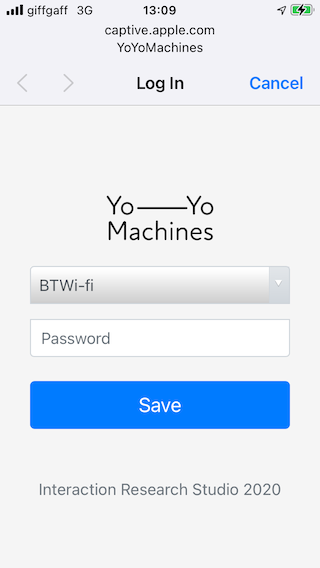

# The Yo-Yo WiFi Manager Library
The Yo-Yo WiFi Manager Library is an [Arduino](http://www.arduino.cc/download) Library for [ESP8266](https://en.wikipedia.org/wiki/ESP8266) and [ESP32](https://en.wikipedia.org/wiki/ESP32) that manages WiFi credentials via a [captive portal](https://en.wikipedia.org/wiki/Captive_portal) configuration webpage; in this respect it is an alternative to the excellent [WiFiManager](https://github.com/tzapu/WiFiManager). However, the Yo-Yo WiFi Manager Library also supports the configuration of multiple devices simultaneously through one portal page, manages multiple sets of network credentials per device and offers full customisation of the portal HTML and JavaScript. 

Beyond WiFi credential management, the Yo-Yo WiFi Manager Library provides a means to host rich web experiences that can integrate with electronics for Physical Computing applications. Hosted webpages using HTML and JavaScript can call custom RESTful endpoints that can easily be defined to talk directly to the ESP modules and any external circuitry. The webserver can serve any [SPIFFS](https://docs.espressif.com/projects/esp-idf/en/latest/esp32/api-reference/storage/spiffs.html) file, be that media files (JPEG, PNG, MP3, etc) or any JavaScript libraries ([jQuery](https://jquery.com/), [bootstrap.js](https://getbootstrap.com/), [Vue.js](https://vuejs.org/), [p5.js](https://p5js.org/), etc) within the storage capacity of the device. Operating as a captive portal and managing its own WiFi network, there is no requirement for an Internet connection. Furthermore, the library will manage local peer networks of multiple devices operating together in this way.

The library is being developed by David Chatting ([@davidchatting](https://github.com/davidchatting)), Mike Vanis ([@mikevanis](https://github.com/mikevanis)) and Andy Sheen ([@andysheen](https://github.com/andysheen)) for the [Yo–Yo Machines](https://www.yoyomachines.io/) project at the [Interaction Research Studio](https://github.com/interactionresearchstudio) - Goldsmiths, University of London. Collaboration welcome - please contribute by raising issues and making pull requests via GitHub.

## Installation

~~The latest stable release of the library is available in the Arduino IDE Library Manager - search for "YoYoWiFiManager". Click install.~~

Alternatively, the library can be installed manually. First locate and open the `libraries` directory used by the Arduino IDE, then clone this repository (https://github.com/interactionresearchstudio/YoYoNetworkManager) into that folder - this will create a new subfolder called `YoYoWiFiManager`.

The Yo-Yo WiFi Manager requires that either the Arduino core for the ESP8266 or ESP32 is installed - follow these instructions:

* ESP8266 - https://github.com/esp8266/Arduino#installing-with-boards-manager
* ESP32 - https://github.com/espressif/arduino-esp32/blob/master/docs/arduino-ide/boards_manager.md

### Sketch Data Folder Uploader Tool
* ESP8266 - https://randomnerdtutorials.com/install-esp8266-filesystem-uploader-arduino-ide/
* ESP32 - https://randomnerdtutorials.com/install-esp32-filesystem-uploader-arduino-ide/

## Examples

This section describes in some technical detail each of the examples available from the `Examples` menu once the Yo-Yo WiFi Manager is correctly installed.

To compile these examples in the *Tools* menu select either `Generic ESP822 Module` or `ESP32 Dev Module`. The data folders in an each example contains the HTML, JavaScript and image files - these need to be uploaded separately. Here the data folders do not exceed 1MB, so in the `Tools` menu for the ESP8266 select `4MB (FS:3MB OTA:~512KB)` for *Flash Size* and for the ESP32 select a *Partition Scheme* of `Default 4MB with spiffs (1.2MB APP/1.5MB SPIFFS)` - assuming a *Flash Size* of 4MB. Then upload the associated `data` folder using the uploader tool - also found under the *Tools* menu.

Every Yo-Yo WiFi Manager sketch has this essential structure:

```
#include <YoYoWiFiManager.h>
YoYoWiFiManager wifiManager;

void setup() {
  wifiManager.init();
  wifiManager.begin("YoYoMachines", "blinkblink");
}

void loop() {
  wifiManager.loop();
}
```

### Basic

```
#include <YoYoWiFiManager.h>
#include <YoYoSettings.h>

YoYoWiFiManager wifiManager;
YoYoSettings *settings;

void setup() {
    //Load any previously saved settings (max capacity of 512 bytes):
    settings = new YoYoSettings(512);
    wifiManager.init(settings, onceConnected);

    //Attempt to connect to a WiFi network previously saved in the settings, 
    //if one can not be found start a captive portal called "YoYoMachines", 
    //with a password of "blinkblink" to configure a new one:
    wifiManager.begin("YoYoMachines", "blinkblink");
}

void onceConnected() {
    //Runs once when we are connected to a WiFi network
}

void loop() {
    //wifiManager.loop() must always be called:
    uint8_t wifiStatus = wifiManager.loop();

    if(wifiStatus == YY_CONNECTED) {
        //Runs whenever we are connected to a WiFi network
    }
}
```

Once started, by default the built-in LED will flash every second until a network is found or if none is available (with a minimum timeout of 30 seconds) the LED will light constantly and create a captive portal page. The `data` folder contains this page, a basic HTML form to configure a local WiFi network - with the credentials specified in wifiManager.begin(). Once the network is configured and connected the LED will blink quickly three times and then stay off. If the connected network becomes unavailable, after a minimum timeout of 30 seconds the captive portal network will be restarted to allow reconfiguration. If no clients connect to the captive portal after at least 60 seconds another attempt is made to connect to any known networks. And so on.



If multiple devices are started close to each other and share the same credentials they will automatically form a peer network; setting the network through the captive portal will then simply configure them all.

wifiManager.begin() does not block. YY_CONNECTED is equivalent to and numerically equal to [WL_CONNECTED](https://www.arduino.cc/en/Reference/WiFiStatus).

### BasicWithEndpoints
### P5js
### PeerNetwork
### Vue

## Endpoints
The following endpoints are built-in:

/yoyo/credentials GET + POST

/yoyo/networks GET

/yoyo/clients GET

/yoyo/peers GET

## Development

* Fix the TODOs in the existing codebase
* The default HTML page should generate a page that allows basic wifi config
* Network discovery - zero conf (bonjour) support - use of iBeacon on the ESP32?
* HTTP File upload to SPIFFS
* SD card support as an alternative to SPIFFS
* Use of websockets to stream sensor values
* Support for peer-to-peer serverless connections across the Internet

## Limitations
The Yo-Yo WiFi Manager works with 2.4GHz WiFi networks, but not 5GHz networks - neither ESP8266 or ESP32 support this technology.